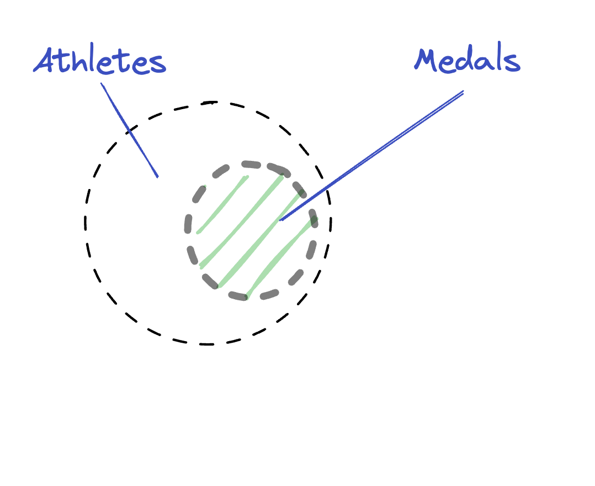
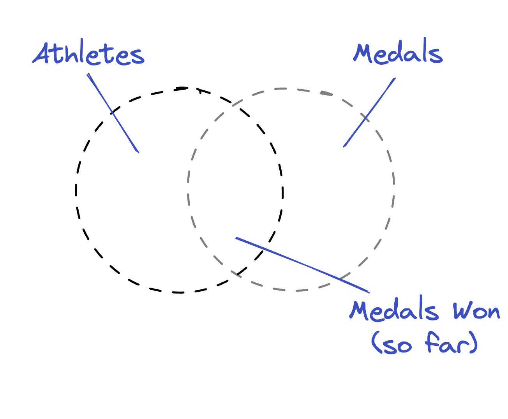
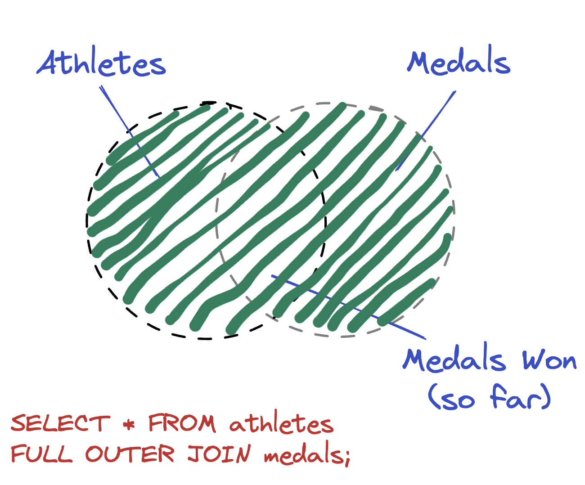
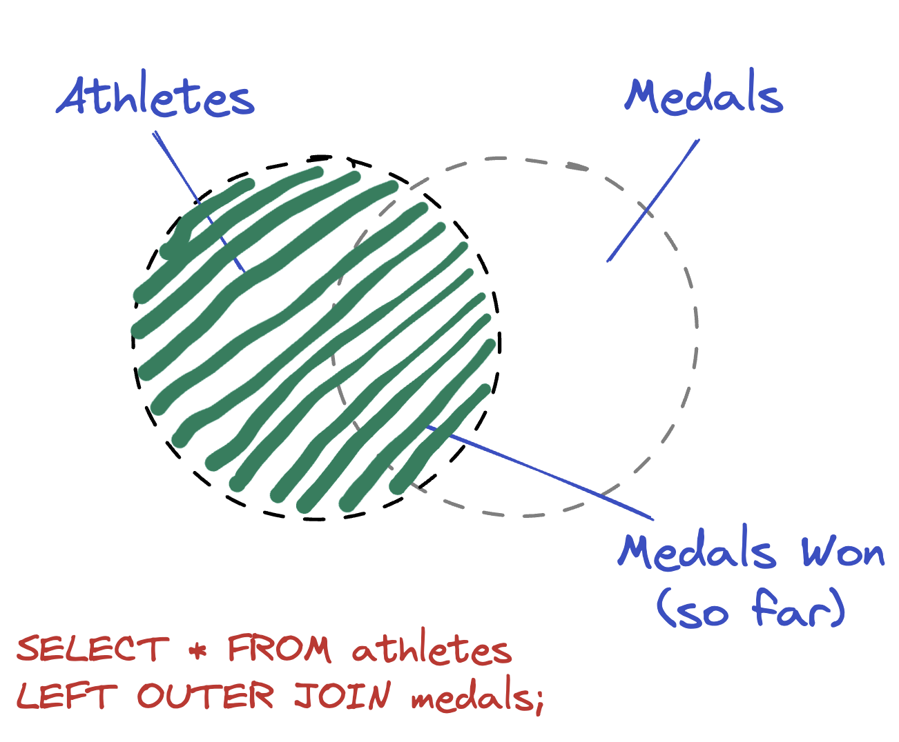
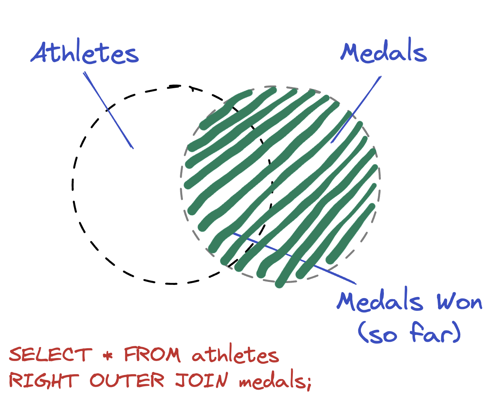

# Combine data from multiple tables using SQL Joins

_**This is a Makers Bite.** Bites are designed to train specific skills or
tools. They contain an intro, a demonstration video, some exercises with an
example solution video, and a challenge without a solution video for you to test
your learning. [Read more about how to use Makers
Bites.](https://github.com/makersacademy/course/blob/main/labels/bites.md)_

Learn to combine data using SQL Joins.

## Introduction

So far, you've learned how to write queries that get data from one table but
answering some questions requires you to merge data that is stored in different
tables.

For example...

- Who was the oldest medal winner?
- Who was the youngest medal winner?

To answer these questions we need data from both `athletes`, which contains a
`date_of_birth` for each paralympian and `medals` which contains data regarding
all the medals that were won.

To answer questions like this, you'll use `JOIN` queries, of which there are two
main types.

- `INNER JOIN`s
- `OUTER JOIN`s

Both types of `JOIN` query involve matching records based on one or more
specific fields. So, for example, we could match records in `athletes` with
records in `medals` using `name` which is present in both tables and (hopefully)
no two `athletes` have the exact same name.

When you attempt a `JOIN`, you might find that all records from both tables
match or, more likely, you'll find that some records from one or both tables do
not match.

In the case of our Paralympics data, we're likely to find that not all athletes
won a medal, so if we try to `JOIN` `athletes` with `medals` matching `ON`
`name`, some of the `athletes` will remain unmatched.

The difference between `INNNER JOINS` and `OUTER JOINS` lies in what happens to
the unmatched records.

## `INNER JOIN`

`INNER JOIN` only returns records matched records. So if you did an `INNER JOIN`
of `athletes` and `medals` you'd get a result set that only included athletes
who had won at least one medal.



What does that query look like?

```sql
SELECT * FROM athletes INNER JOIN medals ON athletes.name = medals.name;
```

Let's break that down...


The first bit should be quite familiar.

```sql
SELECT * FROM athletes
```

The next bit is where we state what type of join we want and which other table
we want to use.

```sql
INNER JOIN medals
```

Then, we have to say how the records will be matched across tables. In this
case, we want records to be matched when the `name` matches.

```sql
ON athletes.name = medals.name
```

If you haven't already executed the query, do so now - you will get 2233 rows in
your result. Is that correct? How could you find out?

<br>
<details>
  <summary>
    Show me the answer!
  </summary>
  <h3>
    The number is too high - there are only 2142 medals!
  </h3>
  <p>
    Some athletes competed in more than one sport and, as a result, have more than one record in the <code>athletes</code> table. When the <code>athletes</code> table is then joined with the <code>medals</code> table on <code>name</code> some duplication occurs. For example, HOET Griet entered two events, meaning they have two records in <code>athletes</code> and they won one medal. When the <code>INNER JOIN</code> is done on <code>name</code>, both records for HOET Griet in <code>athletes</code> match with the one record in <code>medals</code> leading to two rows for HOET Griet in the results.
<table>
<caption>Athletes table</caption>
<thead>
  <tr>
    <th>id</th>
    <th>name</th>
    <th>sport</th>
  </tr>
</thead>
<tbody>
  <tr>
    <td>1</td>
    <td>HOET, Griet</td>
    <td>Cycling Track</td>
  </tr>
  <tr>
    <td>2</td>
    <td>HOET, Griet</td>
    <td>Cycling Road</td>
  </tr>
</tbody>
</table>
<table>
<caption>Medals table</caption>
<thead>
  <tr>
    <th>id</th>
    <th>name</th>
    <th>sport</th>
    <th>medal</th>
  </tr>
</thead>
<tbody>
  <tr>
    <td>1</td>
    <td>HOET, Griet</td>
    <td>Cycling Track</td>
    <td>Bronze</td>
  </tr>
</tbody>
</table>
<table>
<caption>Result of <code>INNER JOIN</code> on <code>name</code></caption>
<thead>
  <tr>
    <th>id</th>
    <th>name_1</th>
    <th>sport_1</th>
    <th>name_2</th>
    <th>sport_2</th>
    <th>medal</th>
  </tr>
</thead>
<tbody>
  <tr>
    <td>1</td>
    <td>HOET, Griet</td>
    <td>Cycling Track</td>
    <td>HOET, Griet</td>
    <td>Cycling Track</td>
    <td>Bronze</td>
  </tr>
  <tr>
    <td>2</td>
    <td>HOET, Griet</td>
    <td>Cycling Road</td>
    <td>HOET, Griet</td>
    <td>Cycling Track</td>
    <td>Bronze</td>
  </tr>
</tbody>
</table>

  </p>
  <h3>
    OK, how do I avoid this?
  </h3>
  <p>
    To avoid this, <code>INNER JOIN</code> on more than one column. Then the maximum number of matches will be 1 for every record in <code>athletes</code>.
  </p>
  <code>SELECT * FROM athletes INNER JOIN medals ON athletes.name = medals.name AND athletes.sport = medals.sport</code>
</details>
<br>

## `OUTER JOIN`

`INNER JOINS` only return matched records. If you want to return some unmatched
records, you need an outer join. For example, you might want to include in your
results all the athletes who didn't win any medals. I.e. Those athletes for whom
there is no matching record in the `medals` table.

There are three types of `OUTER JOIN` which apply different rules regarding
which records to include.

- `FULL OUTER JOIN`
- `LEFT OUTER JOIN`
- `RIGHT OUTER JOIN`

> :exclamation: IMPORTANT: For the following examples, imagine that the Tokyo Paralympics are
> ongoing right now and that some, but not all medals have been won. So there
> would be some unmatched athletes (who have not yet won a medal) and some
> unmatched medals (that have not yet been won).



### `FULL OUTER JOIN`

These are the most straightforward - the results include all matched and
unmatched records.

This will return all the matched and unmatched records from both tables (5082).



### `LEFT OUTER JOIN`

This will return all the records from whichever table you list first in your
query (i.e. on the left) and only the matched records from the second table. If
we list athletes first, as below, the result is all the `athletes`, with those
who have won medals matched against records from the `medals` table.



### `RIGHT OUTER JOIN`

This will return all the records from whichever table you list second in your
query (i.e. on the right) and only the matched records from the first table. If
we list medals second, the result is all the `medals`, with those that have been
won matched against records from the `athletes` table.



## `SELF JOIN`

There's a third type of `JOIN` which actually overlaps both `INNER` and `OUTER
JOINS` - `SELF JOIN`. This is where you match records against other records of
the same table. That probably sounds like an odd thing to do so let's use this
example - unfortunately the Paralympics data set doesn't work well here so we'll
need another example.

Imagine you have a table called `staff` and that each record corresponds to
either a regular member of staff or a manager.

<table>
<caption>Staff</captio>
<thead>
  <tr>
    <th>id</th>
    <th>name</th>
    <th>manager_id</th>
  </tr>
</thead>
<tbody>
  <tr>
    <td>1</td>
    <td>HOET, Griet</td>
    <td>2</td>
  </tr>
  <tr>
    <td>2</td>
    <td>HE, Zihao</td>
    <td></td>
  </tr>
  <tr>
    <td>3</td>
    <td>AAJIM Munkhbat</td>
    <td>2</td>
  </tr>
  <tr>
    <td>4</td>
    <td>NEMATI Zahra</td>
    <td>5</td>
  </tr>
  <tr>
    <td>5</td>
    <td>DRAHONINSKY David</td>
    <td></td>
  </tr>
</tbody>
</table>

Regular members of staff have a `manager_id` to show which other member of staff
is there manager. For example He, Zihao manages both HOET, Griet and AAJIM
Munkhbat.

So that you can see management relationships more easily, you want to create a
table that looks like this.

<table>
<thead>
  <tr>
    <th>id</th>
    <th>staff</th>
    <th>manager</th>
  </tr>
</thead>
<tbody>
  <tr>
    <td>1</td>
    <td>HOET, Griet</td>
    <td>He, Zihao</td>
  </tr>
  <tr>
    <td>3</td>
    <td>AAJIM Munkhbat</td>
    <td>He, Zihao</td>
  </tr>
  <tr>
    <td>4</td>
    <td>NEMATI Zahra</td>
    <td>DRAHONINSKY David</td>
  </tr>
</tbody>
</table>

Since this requires you to bring data together from different rows in the same
table, `SELF JOIN` is the answer. Specifically, we need an `INNER SELF JOIN`
because we're not aiming to have any unmatched records in our output. Note that
in `SELF JOIN`s we need to create two different aliases for the table so that it
can be referred to twice (this is what's happening on the second line below
where you see `staff alias_a` and `staff alias_b`).

```sql
SELECT alias_a.name staff, alias_b.name manager
FROM staff alias_a INNER JOIN staff alias_b
ON alias_a.id =  alias_b.manager_id;
```

## Exercise

Answer the original questions that were posed at the start of this bite

- Who was the oldest medal winner?
- Who was the youngest medal winner?

<br>
  <details>
    <summary>Solutions</summary>
    <br>
    <h3>Who was the oldest medal winner?</h3>
    <p>
      Since <code>date_of_birth</code> is of type <code>date</code>, we can sort on that column after doing the join. The oldest medal winner appears at the top.
    </p>
    <code>
      SELECT athletes.name, athletes.date_of_birth, medals.medal<br>
      FROM athletes INNER JOIN medals<br>
      ON athletes.name = medals.name AND athletes.sport = medals.sport<br>
      ORDER BY athletes.date_of_birth
      LIMIT 5;
    </code>
    <br>
    <br>
    <table>
      <caption>Oldest Medal Winners</caption>
      <thead>
        <tr>
          <th>id</th>
          <th>name</th>
          <th>date_of_birth</th>
          <th>medal</th>
        </tr>
      </thead>
      <tbody>
        <tr>
          <td>1</td>
          <td>FREI Heinz</td>
          <td>1958-01-28</td>
          <td>Silver Medal</td>
        </tr>
        <tr>
          <td>3</td>
          <td>PUSHPASHEVA Nadezhda</td>
          <td>1959-12-29</td>
          <td>Bronze Medal</td>
        </tr>
        <tr>
          <td>4</td>
          <td>ETZNER JAKOBSSON Louise</td>
          <td>1960-06-09</td>
          <td>Silver Medal</td>
        </tr>
        <tr>
          <td></td>
          <td>COOKE Carol</td>
          <td>1961-08-06</td>
          <td>Silver Medal</td>
        </tr>
        <tr>
          <td></td>
          <td>WALSH Jill</td>
          <td>1963-06-19</td>
          <td>Bronze Medal</td>
        </tr>
      </tbody>
    </table>
    <br>
    <br>
    <h3>Who was the youngest medal winner?</h3>
    <p>
    Adding <code>DESC</code> reverses the order so the youngest medal winner appears at the top.
    </p>
    <code>
      SELECT athletes.name, athletes.date_of_birth, medals.medal<br>
      FROM athletes INNER JOIN medals<br>
      ON athletes.name = medals.name AND athletes.sport = medals.sport<br>
      ORDER BY athletes.date_of_birth DESC
      LIMIT 5;
    </code>
    <br>
    <br>
    <table>
      <caption>Youngest Medal Winners</caption>
      <thead>
        <tr>
          <th>id</th>
          <th>name</th>
          <th>date_of_birth</th>
          <th>medal</th>
        </tr>
      </thead>
      <tbody>
        <tr>
          <td>1</td>
          <td>YAMADA Miyuki</td>
          <td>2006-09-15</td>
          <td>Silver Medal</td>
        </tr>
        <tr>
          <td>3</td>
          <td>YAMADA Miyuki</td>
          <td>2006-09-15</td>
          <td>Silver Medal</td>
        </tr>
        <tr>
          <td>4</td>
          <td>VINCENT Isabella</td>
          <td>2006-01-14</td>
          <td>Bronze Medal</td>
        </tr>
        <tr>
          <td></td>
          <td>VINCENT Isabella</td>
          <td>2006-01-14</td>
          <td>Silver Medal</td>
        </tr>
        <tr>
          <td></td>
          <td>CAMACHO RAMIREZ Angel de Jesus</td>
          <td>2004-12-28</td>
          <td>Bronze Medal</td>
        </tr>
      </tbody>
    </table>
  </details>
<br>


## JOINS Recap

It can be easy to get confused with JOINS. For reference when attempting more difficult challenges in this module and future modules. You can come back to this point and recap the differences between the JOINS:

- Inner Joins will join together two tables, and ONLY include matches. For example if your first table (often called the `LEFT` table) has a column called artist_id, and your second table (often called the `RIGHT` table) also has a column called artist_id, an `INNER JOIN` will make a new table that includes all the rows from the `LEFT` and `RIGHT` tables where there are matches in both. If there was a row in the `LEFT` table with the value of, say, 3 in the `artist_id` column, but no 3 in the `artist_id` column in the `RIGHT` table, then that row would be left out.

- Full Outer Joins will join both you `LEFT` and your `RIGHT` tables together regardless of whether there are matches; it will display a new table with `null` in the value field for the row that doesn't have a corresponding match. 

- Left Outer Joins will look for matches on the table you specify first, i.e. table one, or the `LEFT` table.

- Right Outer Joins will look for matches on the table you specify second (the table you choose to JOIN on), i.e. table two, or the `RIGHT` table.

- Self Joins are where you make a new table from matching rows within the same starting table! We do this by making an alias "fake" `LEFT` table and an alias "fake" `RIGHT` table from the same starting table. 


## Challenge

Use a `SELF JOIN` to find athletes that share a birthday.

> Bonus challenge: Try to avoid matching an athlete with themselves


[Next Challenge](11_sql_subqueries_bite.md)

<!-- BEGIN GENERATED SECTION DO NOT EDIT -->

---

**How was this resource?**  
[😫](https://airtable.com/shrUJ3t7KLMqVRFKR?prefill_Repository=makersacademy%2Fsql-for-data-processing-and-analysis&prefill_File=sql_bites%2F10_sql_joins_bite.md&prefill_Sentiment=😫) [😕](https://airtable.com/shrUJ3t7KLMqVRFKR?prefill_Repository=makersacademy%2Fsql-for-data-processing-and-analysis&prefill_File=sql_bites%2F10_sql_joins_bite.md&prefill_Sentiment=😕) [😐](https://airtable.com/shrUJ3t7KLMqVRFKR?prefill_Repository=makersacademy%2Fsql-for-data-processing-and-analysis&prefill_File=sql_bites%2F10_sql_joins_bite.md&prefill_Sentiment=😐) [🙂](https://airtable.com/shrUJ3t7KLMqVRFKR?prefill_Repository=makersacademy%2Fsql-for-data-processing-and-analysis&prefill_File=sql_bites%2F10_sql_joins_bite.md&prefill_Sentiment=🙂) [😀](https://airtable.com/shrUJ3t7KLMqVRFKR?prefill_Repository=makersacademy%2Fsql-for-data-processing-and-analysis&prefill_File=sql_bites%2F10_sql_joins_bite.md&prefill_Sentiment=😀)  
Click an emoji to tell us.

<!-- END GENERATED SECTION DO NOT EDIT -->
